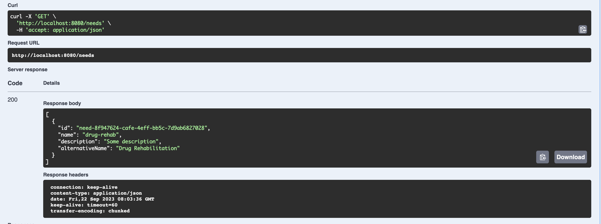
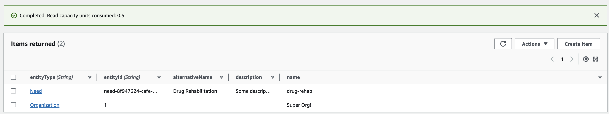

# Beneficiary Collaboration - Spring Board Service

## Summary

TBD

## DynamoDb Table Setup

We are following a single table model. What that means is that all of our data is stored in a single DynamoDb table.

This allows us to optimize our persistence layer.

We define the PK to be the name of our object, i.e. Beneficiary then we have a sort key that would be the unique identifier of the object,
then we will have a `EntityData` attribute that will provide dynamic data (this will depend on the object it is associated with).


#### Post call to create a Need


#### Resulting DynamoDb record


### Local Development

If you want to setup your table, we recommend downloading the docker container for local DynamoDb. This will allow
you to test out your service locally.

To download it and start running it, you will use the following commands:

```bash
docker pull amazon/dynamodb-local
docker run -p 8000:8000 amazon/dynamodb-local
```

Then you can create the table using this script. Which is also located under /useful-local-scripts/setup.table.sh

```bash
"#!/bin/bash"

echo "Setting up your dynamodb table..."

aws dynamodb create-table --cli-input-json file://./dynamodb/beneficiary-collaboration-table.json --endpoint-url http://localhost:8000

echo "Done!"
```

### Describe Table Output

#### Command

```bash
aws dynamodb describe-table --table-name beneficary-collaboration-table
```

#### Output
```json 
{
    "Table": {
        "AttributeDefinitions": [
            {
                "AttributeName": "EntityKey",
                "AttributeType": "S"
            },
            {
                "AttributeName": "EntityType",
                "AttributeType": "S"
            }
        ],
        "TableName": "beneficary-collaboration-table",
        "KeySchema": [
            {
                "AttributeName": "EntityType",
                "KeyType": "HASH"
            },
            {
                "AttributeName": "EntityKey",
                "KeyType": "RANGE"
            }
        ],
        "TableStatus": "ACTIVE",
        "CreationDateTime": "2023-09-21T21:19:37.894000-05:00",
        "ProvisionedThroughput": {
            "LastDecreaseDateTime": "2023-09-21T21:28:57.505000-05:00",
            "NumberOfDecreasesToday": 2,
            "ReadCapacityUnits": 1,
            "WriteCapacityUnits": 1
        },
        "TableSizeBytes": 0,
        "ItemCount": 0,
        "TableArn": "arn:aws:dynamodb:us-east-1:416539513472:table/beneficary-collaboration-table",
        "TableId": "83fd4717-df34-4a81-a29b-95c029d1dd99",
        "TableClassSummary": {
            "TableClass": "STANDARD"
        }
    }
}
```