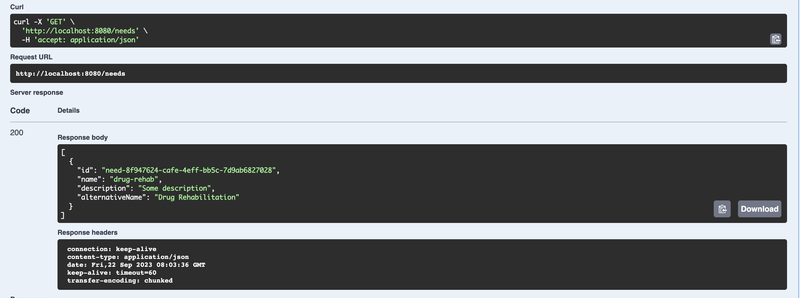
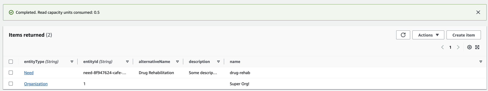

# Developer Guide

### Endpoints exposed

You can find the endpoints exposed by viewing the open api specification. This is under the top level folder of `open-api`.

If you want to view it through a graphical user interface. There are a few options for you:

1. [Intellij Plugin - OpenAPI ​(Swagger)​ Editor](https://plugins.jetbrains.com/plugin/14837-openapi-swagger-editor)
2. [Visual Studio Code Extension - Swagger Viewer](https://marketplace.visualstudio.com/items?itemName=42Crunch.vscode-openapi)
3. [Browser option - OpenAPI GUI](https://mermade.github.io/openapi-gui/)

## Quick Get Started Guide

To help anyone get starting running the minute they start this project!

1. Setup Java. We are currently using Java 11
    - You can download it from here - https://www.oracle.com/java/technologies/downloads/
    - Please follow the guides for installation
2. Build your project. You can use the `.gradlew clean build` for mac and `.gradlew.bat clean build` for windows
3. Finally, run your java jar either locally using `java -jar <path-to-jar (most likely under build directory)>` or set
   it up in Intellij or Visual Studio code.

For connection to aws, we are only using DynamoDb. You can use this guide [Setup Local AWS Credentials](https://docs.aws.amazon.com/sdk-for-java/v1/developer-guide/setup-credentials.html)

### Environments

| Environment | Properties                                    |
|-------------|-----------------------------------------------|
| local       | tableName: beneficiary-collaboration-table-dp |
| default     | tableName: beneficiary-collaboration-table    |

If you need to update the table name that you use, replace the value of the tableName property.

This is a guide to swapping between Spring profiles and leveraging it - [Spring Profiles](https://www.baeldung.com/spring-profiles)

## DynamoDb Table Setup

We are following a single table model. What that means is that all of our data is stored in a single DynamoDb table.

This allows us to optimize our persistence layer.

We define the PK to be the name of our object, i.e. Beneficiary then we have a sort key that would be the unique
identifier of the object,
then we will have a `EntityData` attribute that will provide dynamic data (this will depend on the object it is
associated with).

#### Post call to create a Need



#### Resulting DynamoDb record



### Local Development

If you want to set up your table, we recommend downloading the docker container for local DynamoDb. This will allow
you to test out your service locally.

To download it and start running it, you will use the following commands:

```bash
docker pull amazon/dynamodb-local
docker run -p 8000:8000 amazon/dynamodb-local
```

Then you can create the table using this script. Which is also located under /useful-local-scripts/setup.table.sh

```bash
"#!/bin/bash"

echo "Setting up your dynamodb table..."

aws dynamodb create-table --cli-input-json file://./dynamodb/beneficiary-collaboration-table.json --endpoint-url http://localhost:8000

echo "Done!"
```

### Describe Table Output

#### Command

```bash
aws dynamodb describe-table --table-name beneficary-collaboration-table
```

#### Output

```json 
{
  "Table": {
    "AttributeDefinitions": [
      {
        "AttributeName": "EntityKey",
        "AttributeType": "S"
      },
      {
        "AttributeName": "EntityType",
        "AttributeType": "S"
      }
    ],
    "TableName": "beneficary-collaboration-table",
    "KeySchema": [
      {
        "AttributeName": "EntityType",
        "KeyType": "HASH"
      },
      {
        "AttributeName": "EntityKey",
        "KeyType": "RANGE"
      }
    ],
    "TableStatus": "ACTIVE",
    "CreationDateTime": "2023-09-21T21:19:37.894000-05:00",
    "ProvisionedThroughput": {
      "LastDecreaseDateTime": "2023-09-21T21:28:57.505000-05:00",
      "NumberOfDecreasesToday": 2,
      "ReadCapacityUnits": 1,
      "WriteCapacityUnits": 1
    },
    "TableSizeBytes": 0,
    "ItemCount": 0,
    "TableArn": "arn:aws:dynamodb:us-east-1:416539513472:table/beneficary-collaboration-table",
    "TableId": "83fd4717-df34-4a81-a29b-95c029d1dd99",
    "TableClassSummary": {
      "TableClass": "STANDARD"
    }
  }
}
```